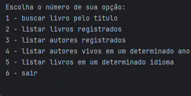
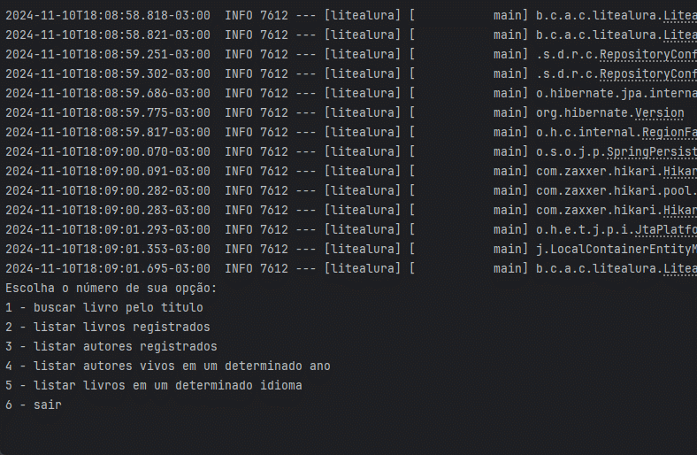
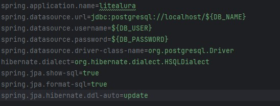

# 📖 LiterBooks 📖

## Sobre o Projeto

LiterBooks é uma aplicação prática e intuitiva que permite acessar uma vasta coleção de livros sem copyright, usando uma API pública. Através desta aplicação, os usuários podem buscar informações completas sobre livros, incluindo detalhes sobre os autores e seu histórico.

## Funcionalidades

- **Menu interativo**: Navegação simples com opções pré-definidas para facilitar o uso.
- **Busca por Título**: Encontre informações detalhadas de livros pelo título.
- **Listar Livros e Autores Salvos**: Visualize livros e autores armazenados no banco de dados.
- **Filtro por Autores Vivos**: Filtre autores que estavam vivos em um determinado ano.
- **Filtro por Idioma**: Busque livros por idioma usando o código de país (exemplo: `pt` para português).

### Demonstração

| Funcionalidade                    | Visual                                                   |
|-----------------------------------|----------------------------------------------------------|
| Menu Interativo                   |         |
| Busca por Título                  |  |
| Listar Livros no Banco de Dados   |    |
| Listar Autores no Banco de Dados  |   |
| Filtrar Autores Vivos em Ano Específico |  |
| Filtrar Livros por Idioma         |  |

## 🛠️ Tecnologias Utilizadas

- **Java**
- **Spring Boot**
- **PostgreSQL**
- **Trello** (para gerenciamento de tarefas)
- **Gutendex API** ([gutendex.com](https://gutendex.com/))

## 🚀 Como Executar o Projeto

1. Clone o repositório:
   ```bash
   git clone https://github.com/Tulipaox/LiterAlura.git

### Modo de usar
<p>Clone o projeto e baixe na sua máquina.</p> 
<p>Primeiro, abra a pasta resources.
Troque as variáveis de ambiente pelas suas variáveis ou pelos seus dados do PostgreSQL. 
Crie um banco de dados para começar a salvar no banco.
Pronto! Fazendo isso, você já consegue utilizar a aplicação.
</p>


📂 Estrutura do Projeto
A estrutura do projeto foi organizada para facilitar a manutenção e evolução da aplicação, seguindo boas práticas de desenvolvimento e divisão modular de responsabilidades.

## 📄 Licença

````declarative
MIT License
````
